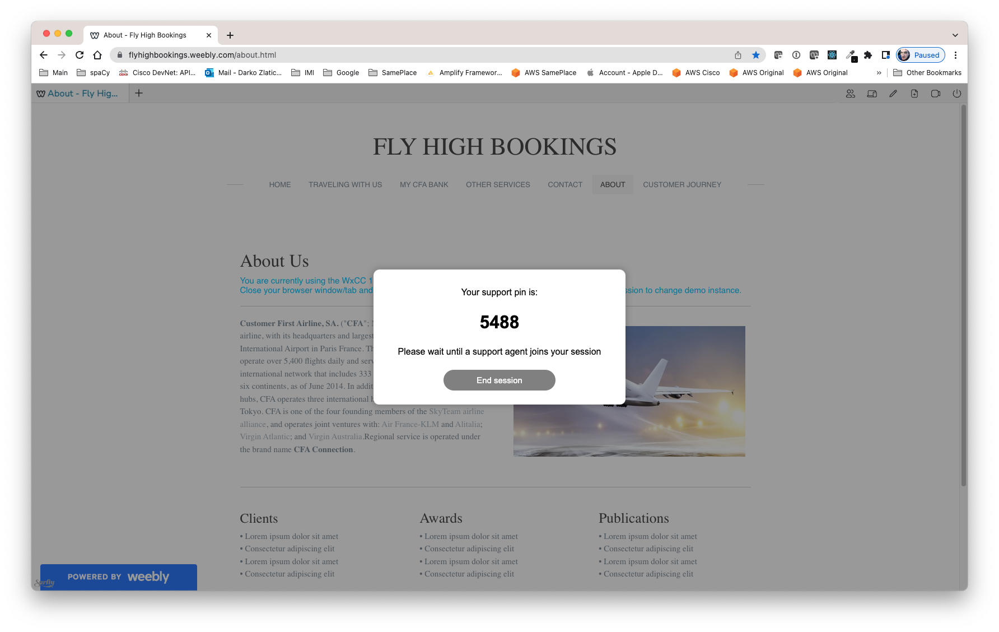
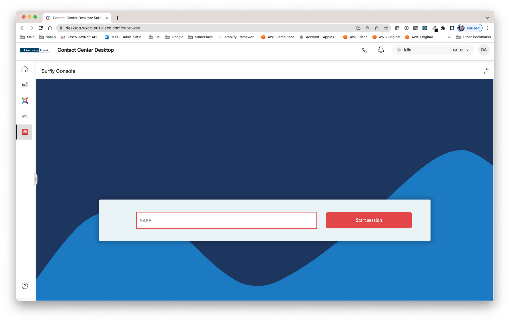
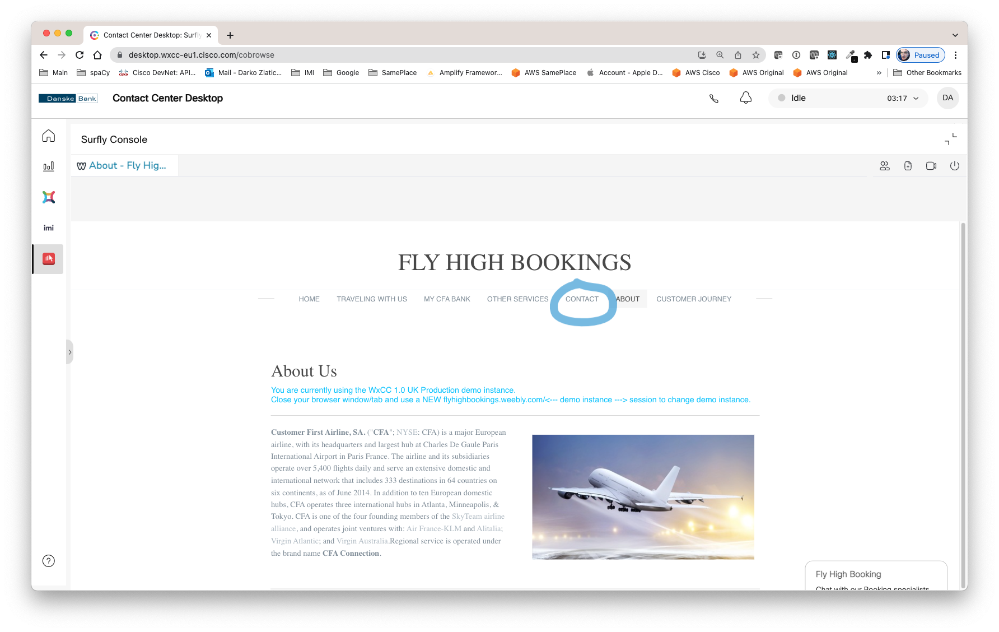

---
# WxCC Custom Widget: Surfly co-browse


## Introduction

Cisco WxCC Desktop currently doesn't offer out-of-box co-browse functionality. This custom widget allows [Surfly](https://www.surfly.com/universal-co-browsing/) co-browse integration and enables WxCC contact centre agents to use co-browse as an adjunct channel when serving customers with voice or messaging channels. 

Basically, while on exiting voice or messaging interaction with the customer, agent can propose co-browse session. Customer is supposed to initiate bo-browse session from a known page and communicate session code with the agent.



Than, agent switch to Surfly co-browse pannel, enters the code shared by the customer, verbally or in the message. 



The co-browse session starts. If needed, the agent can move away from co-brose session, use other panes in WxCC and return to continue co-browse. 



---
**Not in this version:** 
This version of the widget do not support:
- WxCC Reporting
- Rich Customer History, neither Journey Data Services integration
- Handling of standalone Surfly queue
---
**Important notes:** 
- This version of widget is also tested for video support inside Surfly, but you would have to allow use of camera and microphone in your browser.
- Sometimes VPN and Surfly don't play nicely together and you may get 406 message! Prepare and test your demo in advance and avoid any surprises. For production issues, please work with your IT department and Surfly support. This custom widget component is not supported by Cisco!
---
**Possible Surfly Defect - under investigation:** 
- While running demo, do not keep Surfly admin session open, as it creates a conflict with your agent session and APIs do not report a proper session owneship, so the widget will not be finding an active session after you leave the widget and then come back.
---

## How to deploy

### Surfly Account

Your organization must have an Enterprise account on Surfly.com. 

---
**NOTE:** 
- The build shared on the link below does use temporary Cisco evaluation Enterprise account keys. Usage is closely monitored for misuse! Please do not use it, unless you are part of Cisco, or you work for Cisco partner and you are advised by Cisco to try this component in the demo.
---

### Desktop Layout Configuration 

You can copy the code below into your desktop layout, into "navigation" section:

```
{
      "nav" : {
        "label" : "Surfly",
        "icon" : "https://www.surfly.com/wp-content/uploads/2022/02/favicon_Surfly_big.png",
        "iconType" : "other",
        "navigateTo" : "cobrowse",
        "align" : "top"
      },
      "page" : {
        "id" : "cobrowse",
        "widgets": {
          "console": {
              "comp": "surfly-widget",
              "script": "https://ciscoemearwxcccustomwidgents.s3.eu-central-1.amazonaws.com/surfly-widget/build/surfly-widget.js",
              "attributes": {
                "isDarkMode": "$STORE.app.darkMode",
                "agentName": "$STORE.agent.agentName",
                "agentEmailId": "$STORE.agent.agentEmailId"
              },
              "wrapper": { "title": "Surfly Console", "maximizeAreaName" : "app-maximize-area" }
              }
        },
        "layout": {
          "areas": [["console"]],
          "size": {
            "cols": [1],
            "rows": [1]
          }
        }
      }
    }  
```

## How to customize and rebuild 

Best way to start would be to review documentation: https://developer.webex-cx.com/documentation/guides/desktop and learn about building Custom Widgets.

1. The very first step would be to clone this repository: https://github.com/CiscoDevNet/webex-contact-center-widget-starter .

2. Replace all files in started widget repository with those provided in this repository and rename the root directory to “surfly-widget”.

3. Enter your Surfly REST API code into the [App.tsx](react/src/direflow-component/App.tsx) file.

4. Follow instructions from starter widget README file to build the component.

5. Once build, the component should be deployed on public URL, and configured in desktop layout, per example above.


## How To Report Errors and Propose Improvements

Please contact Darko Zlatic (dzlatic@cisco.com).
